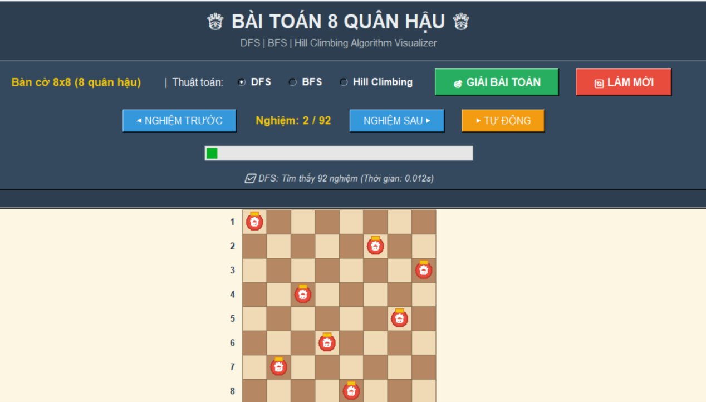
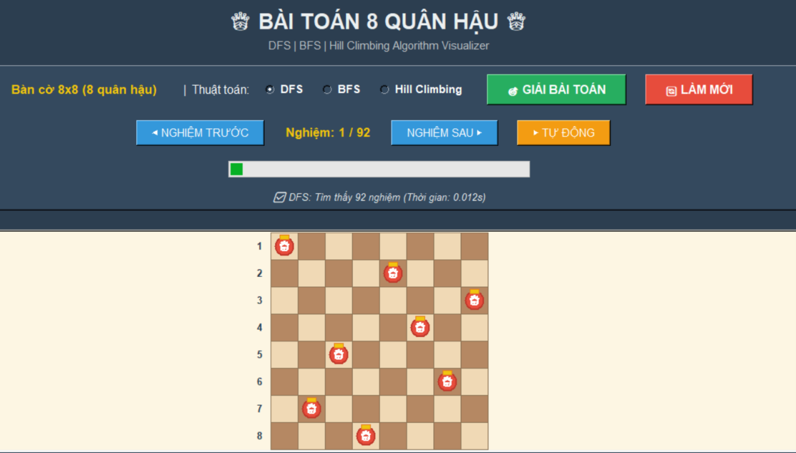
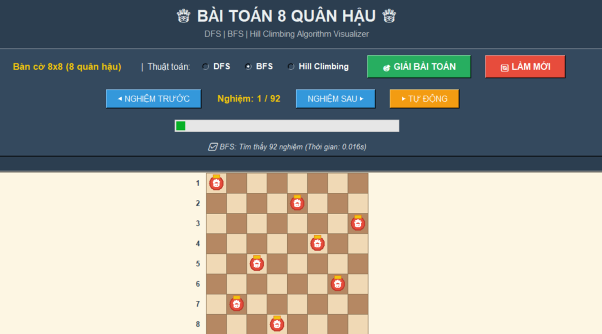
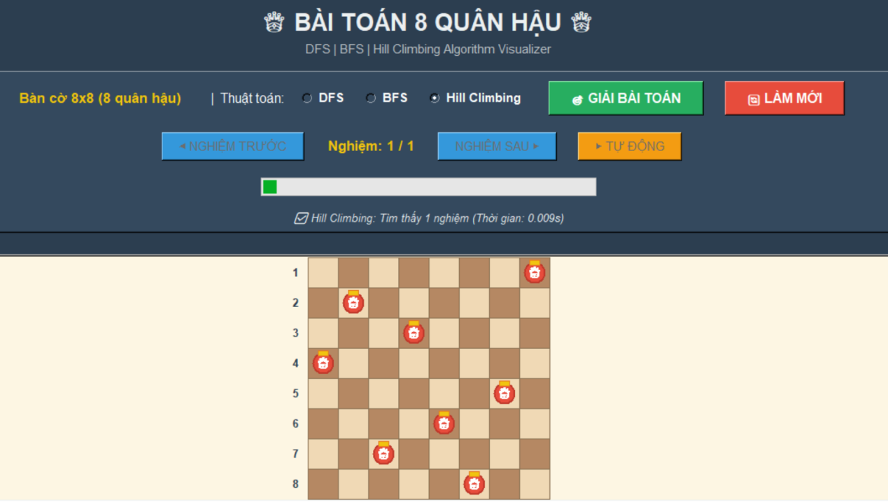

# Bài Toán 8 Quân Hậu

Ứng dụng Python Tkinter mô phỏng và giải bài toán 8 quân hậu trên bàn cờ 8x8 bằng 3 hướng tiếp cận:

- DFS (Backtracking)
- BFS với Priority Queue / Heuristic
- Hill Climbing

---

## Giới thiệu

Bài toán 8 quân hậu là một bài toán kinh điển trong trí tuệ nhân tạo và lý thuyết tìm kiếm.  
Nhiệm vụ là đặt 8 quân hậu lên bàn cờ kích thước 8x8 sao cho không có hai quân hậu nào có thể tấn công lẫn nhau theo hàng, cột hoặc đường chéo.

Dự án này được xây dựng nhằm:

- Minh họa cách hoạt động của các thuật toán tìm kiếm.
- So sánh hiệu quả giữa DFS, BFS Priority và Hill Climbing.
- Hiển thị kết quả trực quan bằng giao diện đồ họa Tkinter.

---

## Demo giao diện

### 1. Màn hình chính
Giao diện cho phép người dùng chọn thuật toán và bắt đầu giải bài toán.


### 2. DFS
DFS sử dụng backtracking để duyệt lần lượt từng hàng, thử các vị trí hợp lệ và lưu lại toàn bộ nghiệm.



### 3. DFS - 92 nghiệm
Kết quả cho thấy DFS có thể tìm được đầy đủ 92 nghiệm của bài toán 8 quân hậu.



### 4. BFS (Priority Queue / Heuristic)
Phần này sử dụng `heapq` để ưu tiên trạng thái có heuristic tốt hơn.  
Trong báo cáo và khi thuyết trình, có thể mô tả là **BFS kết hợp Priority Queue / Best-First theo heuristic**.



### 5. Hill Climbing
Hill Climbing bắt đầu từ trạng thái ngẫu nhiên, sau đó liên tục cải thiện để giảm xung đột giữa các quân hậu.



---

## Tính năng

- Chọn thuật toán bằng radio button.
- Giải bài toán bằng nút `GIẢI BÀI TOÁN`.
- Hiển thị bàn cờ và vị trí các quân hậu.
- Xem nhiều nghiệm với DFS và BFS Priority.
- Hỗ trợ tự động chuyển nghiệm.
- Làm mới bàn cờ khi cần.

---

## Các thuật toán được sử dụng

### DFS (Depth-First Search)
- Duyệt theo chiều sâu.
- Đặt quân hậu lần lượt theo từng hàng.
- Nếu đi vào ngõ cụt thì quay lui.
- Có thể tìm ra toàn bộ nghiệm hợp lệ.

### BFS (Priority Queue / Heuristic)
- Dùng hàng đợi ưu tiên để chọn trạng thái tốt hơn trước.
- Mỗi trạng thái được đánh giá bằng heuristic.
- Phù hợp để minh họa tìm kiếm có định hướng.

### Hill Climbing
- Khởi tạo ngẫu nhiên vị trí quân hậu.
- Sinh các trạng thái lân cận.
- Chọn trạng thái có ít xung đột hơn.
- Dừng khi không thể cải thiện thêm.

---

## Cách chạy chương trình

```bash
python3 8Queen.py
```
